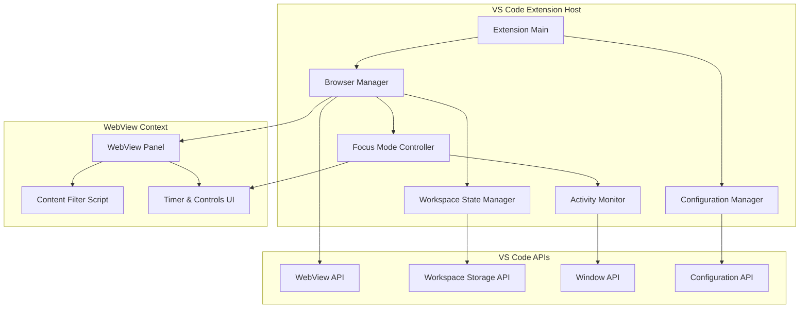

# Design Document: VSFeed

## Overview

The VSFeed extension provides a controlled, distraction-managed browsing experience directly within the VS Code IDE. The system architecture separates concerns into distinct layers: UI presentation (WebView panels), state management (workspace persistence), behavioral controls (focus mode and activity monitoring), and content manipulation (filtering).

The extension leverages VS Code's WebView API to render web content while maintaining IDE performance. The design emphasizes minimal resource usage, responsive state management, and clear separation between the extension host process and the WebView rendering context.

Key architectural principles:
- Lazy loading and resource suspension to minimize IDE impact
- Workspace-scoped state persistence for context preservation
- Event-driven communication between extension and WebView
- Configurable behavior through VS Code settings API
- Graceful degradation when platforms block embedding

## Architecture

### High-Level Component Structure



### Component Responsibilities

**Extension Main**: Entry point that registers commands, activates the extension, and coordinates component lifecycle.

**Browser Manager**: Orchestrates WebView panel creation, visibility, navigation, and disposal. Manages panel positioning (sidebar vs editor).

**Focus Mode Controller**: Implements session timer logic, pause/resume behavior, and automatic panel hiding. Coordinates with Activity Monitor for intelligent pausing.

**Activity Monitor**: Tracks editor interactions using VS Code's text document change events and window state changes. Determines when to pause focus mode timers.

**Configuration Manager**: Provides typed access to extension settings, validates configuration values, and notifies components of changes.

**Workspace State Manager**: Persists and restores browser state (URL, visibility, position) per workspace using VS Code's workspace storage API.

**WebView Panel**: Renders web content using VS Code's WebView API. Executes injected scripts for content filtering and UI overlays.

**Content Filter Script**: Runs in WebView context to hide DOM elements matching configured CSS selectors. Provides visual feedback on filtered content count.

**Timer & Controls UI**: Displays session timer, warning indicators, blur overlays, and control buttons within the WebView.

## Components and Interfaces

### Browser Manager

```typescript
interface BrowserManager {
  // Panel lifecycle
  createPanel(position: PanelPosition): WebViewPanel;
  showPanel(): void;
  hidePanel(): void;
  disposePanel(): void;
  
  // Navigation
  navigateToUrl(url: string): void;
  navigateBack(): void;
  navigateForward(): void;
  
  // Platform shortcuts
  launchPlatform(platform: PlatformShortcut): void;
  
  // State queries
  isVisible(): boolean;
  getCurrentUrl(): string | undefined;
}

enum PanelPosition {
  Sidebar,
  EditorColumn
}

interface PlatformShortcut {
  name: string;
  url: string;
  useMobileUrl: boolean;
}
```

### Focus Mode Controller

```typescript
interface FocusController {
  // Session management
  startSession(durationMinutes: number): void;
  endSession(): void;
  pauseSession(): void;
  resumeSession(): void;
  
  // State queries
  isActive(): boolean;
  getRemainingTime(): number;
  getSessionProgress(): number; // 0.0 to 1.0
  
  // Event notifications
  onTimerTick(callback: (remaining: number) => void): Disposable;
  onSessionEnd(callback: () => void): Disposable;
  onWarningThreshold(callback: () => void): Disposable;
}
```

### Activity Monitor

```typescript
interface ActivityMonitor {
  // Monitoring control
  startMonitoring(): void;
  stopMonitoring(): void;
  
  // Activity queries
  getTimeSinceLastActivity(): number;
  isUserCoding(): boolean;
  getTimeSinceLastBreak(): number;
  
  // Event notifications
  onCodingActivityDetected(callback: () => void): Disposable;
  onBreakSuggestionThreshold(callback: () => void): Disposable;
}
```

### Configuration Manager

```typescript
interface ExtensionConfig {
  // Focus mode settings
  focusMode: {
    defaultDurationMinutes: number; // 1-60
    enableBlurEffect: boolean;
    enableActivityPausing: boolean;
  };
  
  // Break suggestions
  breakSuggestions: {
    enabled: boolean;
    codingThresholdMinutes: number; // 30-180
  };
  
  // Content filtering
  contentFilter: {
    enabled: boolean;
    customRules: FilterRule[];
  };
  
  // Performance
  performance: {
    preferMobileUrls: boolean;
    memoryLimitMB: number;
  };
  
  // Platform shortcuts
  platformShortcuts: PlatformShortcut[];
}

interface FilterRule {
  domain: string;
  selectors: string[];
}
```

### Workspace State Manager

```typescript
interface WorkspaceState {
  currentUrl?: string;
  panelVisible: boolean;
  panelPosition: PanelPosition;
  lastBreakTimestamp?: number;
  authCookies?: Record<string, string>;
}

interface StateManager {
  saveState(state: WorkspaceState): Promise<void>;
  loadState(): Promise<WorkspaceState>;
  clearState(): Promise<void>;
}
```

### WebView Communication Protocol

Messages between extension host and WebView context:

```typescript
// Extension -> WebView
type ExtensionMessage =
  | { type: 'applyContentFilter'; rules: FilterRule[] }
  | { type: 'updateTimer'; remaining: number; total: number }
  | { type: 'showWarning' }
  | { type: 'applyBlur' }
  | { type: 'removeBlur' }
  | { type: 'showOverlay'; message: string };

// WebView -> Extension
type WebViewMessage =
  | { type: 'navigationComplete'; url: string }
  | { type: 'navigationFailed'; error: string }
  | { type: 'filterApplied'; elementCount: number }
  | { type: 'userAction'; action: 'endSession' | 'resumeCoding' };
```

## Data Models

### Session State

```typescript
interface SessionState {
  sessionId: string;
  startTime: number;
  durationMs: number;
  remainingMs: number;
  isPaused: boolean;
  pausedAt?: number;
}
```

### Activity Tracking

```typescript
interface ActivityState {
  lastEditorInteraction: number;
  lastBreakTime: number;
  continuousCodingDuration: number;
  isCurrentlyCoding: boolean;
}
```

### Panel State

```typescript
interface PanelState {
  panel?: vscode.WebviewPanel;
  currentUrl?: string;
  isVisible: boolean;
  position: PanelPosition;
  loadingState: 'idle' | 'loading' | 'loaded' | 'error';
  errorMessage?: string;
}
```

### Content Filter State

```typescript
interface FilterState {
  enabled: boolean;
  activeRules: FilterRule[];
  lastFilteredCount: number;
  predefinedRules: {
    instagram: FilterRule;
    reddit: FilterRule;
  };
}
```

## Implementation Approach

### WebView Panel Creation

The Browser Manager creates WebView panels with specific options:
- `enableScripts: true` for content filtering and UI overlays
- `retainContextWhenHidden: false` to reduce memory usage
- `localResourceRoots` restricted to extension directory
- Content Security Policy allowing external web content

Panel HTML structure includes:
- iframe for web content rendering
- Overlay div for timer UI and controls
- Injected script for content filtering
- Message passing bridge to extension host

### Focus Mode Timer Implementation

Timer uses `setInterval` with 1-second granularity. On each tick:
1. Check if Activity Monitor indicates coding activity
2. If coding detected for >30s, pause timer
3. If not paused, decrement remaining time
4. Send timer update to WebView for UI display
5. Check for warning threshold (25% remaining)
6. If timer reaches zero, trigger session end

Session end sequence:
1. Stop timer interval
2. Send blur effect message to WebView (if enabled)
3. Hide panel after 2-second delay
4. Show completion notification
5. Update last break timestamp

### Activity Detection Strategy

Activity Monitor subscribes to:
- `vscode.workspace.onDidChangeTextDocument` for typing detection
- `vscode.window.onDidChangeActiveTextEditor` for editor focus
- `vscode.window.onDidChangeWindowState` for window focus

Coding activity criteria:
- Text document changes in last 30 seconds
- Active editor is not the WebView panel
- Window has focus

Break suggestion logic:
- Track time since last break (stored in workspace state)
- When threshold exceeded, show notification
- Reset timer when user accepts break or manually opens browser

### Content Filtering Mechanism

Content filter runs as injected script in WebView:

```typescript
function applyContentFilter(rules: FilterRule[]) {
  const currentDomain = window.location.hostname;
  const matchingRules = rules.filter(r => r.domain === currentDomain);
  
  let hiddenCount = 0;
  matchingRules.forEach(rule => {
    rule.selectors.forEach(selector => {
      document.querySelectorAll(selector).forEach(el => {
        (el as HTMLElement).style.display = 'none';
        hiddenCount++;
      });
    });
  });
  
  // Use MutationObserver to handle dynamically loaded content
  const observer = new MutationObserver(() => {
    // Re-apply filters on DOM changes
  });
  
  observer.observe(document.body, {
    childList: true,
    subtree: true
  });
  
  return hiddenCount;
}
```

Predefined filter rules:
- Instagram: `[aria-label*="Reels"]`, `[href*="/explore/"]`
- Reddit: `[href*="/r/popular/"]`, `[href*="/r/all/"]`

### Workspace State Persistence

State saved on:
- Workspace close event
- Panel navigation
- Configuration changes
- Session end

State restored on:
- Extension activation
- Workspace open

Uses VS Code's `workspaceState.update()` and `workspaceState.get()` with JSON serialization.

### Authentication Cookie Handling

WebView cookies are automatically persisted by VS Code's WebView implementation. Extension provides:
- Command to clear all cookies (calls `webview.clearCookies()`)
- Configuration option to disable cookie persistence
- No direct cookie access (security boundary)

### Performance Optimization

Memory management:
- Set `retainContextWhenHidden: false` to dispose WebView when hidden
- Lazy-load panel only when first accessed
- Suspend rendering when panel not visible
- Monitor memory usage via VS Code's process API

Loading optimization:
- Prefer mobile URLs (lighter pages)
- Show loading indicator after 10s timeout
- Cancel previous navigation if new one starts
- Cache platform shortcut URLs

### Error Handling Patterns

Network errors:
- Catch navigation failures in WebView
- Display error message with retry button
- Log error details to extension output channel

CSP/embedding restrictions:
- Detect X-Frame-Options or CSP violations
- Show explanation message in panel
- Offer "Open in External Browser" button
- Maintain list of known problematic domains

WebView initialization failures:
- Wrap panel creation in try-catch
- Log error with stack trace
- Show user-friendly notification
- Provide "Report Issue" link to GitHub

Configuration validation:
- Validate numeric ranges on settings change
- Show error notification for invalid values
- Revert to previous valid value
- Document valid ranges in settings schema


## Correctness Properties

*A property is a characteristic or behavior that should hold true across all valid executions of a system-essentially, a formal statement about what the system should do. Properties serve as the bridge between human-readable specifications and machine-verifiable correctness guarantees.*

### Property Reflection

After analyzing all acceptance criteria, several properties can be consolidated:

**Workspace State Persistence (8.1, 8.2, 8.3, 8.4)**: These four criteria all test the same round-trip property - that workspace state is correctly saved and restored. They can be combined into a single comprehensive property.

**Cookie/Storage Persistence (10.1, 10.2, 10.5)**: These all test storage round-trip behavior and can be combined into properties about authentication state persistence.

**Configuration Options (multiple)**: Many criteria test that configuration options exist (3.3, 4.4, 5.4, 7.1, 11.5, etc.). These are examples rather than properties and will be tested as unit tests.

**Keyboard Shortcuts (9.1, 9.2, 9.5, 9.6)**: These test that specific shortcuts exist and are examples rather than properties.

**Platform Shortcuts Display (6.1, 6.5)**: These can be combined - testing that all shortcuts (predefined and custom) appear in the toolbar.

### Property 1: Panel Creation and Rendering

*For any* valid browser command activation, the extension should create a WebView panel that successfully renders.

**Validates: Requirements 1.1**

### Property 2: URL Navigation

*For any* valid URL, when loaded in the Browser_Panel, the panel should render the web content and the current URL should be retrievable.

**Validates: Requirements 1.4**

### Property 3: Workspace State Round-Trip

*For any* workspace state (URL, visibility, position), closing and reopening the workspace should restore the exact same state.

**Validates: Requirements 1.6, 8.1, 8.2, 8.3, 8.4**

### Property 4: Focus Mode Timer Countdown

*For any* configured session duration between 1 and 60 minutes, activating Focus_Mode should start a timer that counts down from that duration.

**Validates: Requirements 2.1, 2.4**

### Property 5: Timer Display Updates

*For any* active focus mode session, the remaining time should be displayed in the Browser_Panel UI and update as the timer counts down.

**Validates: Requirements 2.2**

### Property 6: Session Auto-Hide on Timeout

*For any* focus mode session, when the Session_Timer reaches zero, the Browser_Panel should automatically hide.

**Validates: Requirements 2.3**

### Property 7: Session End Notification

*For any* focus mode session that completes (timer reaches zero), a notification should be displayed to the user.

**Validates: Requirements 2.5**

### Property 8: Manual Session Termination

*For any* active focus mode session with remaining time, the user should be able to manually end the session before the timer expires.

**Validates: Requirements 2.6**

### Property 9: Warning Threshold Indicator

*For any* focus mode session, when the remaining time falls below 25% of the configured duration, a warning indicator should be displayed.

**Validates: Requirements 3.1**

### Property 10: Blur Effect on Timeout

*For any* focus mode session where blur-on-timeout is enabled, when the timer reaches zero, a visual blur effect should be applied to the Browser_Panel content.

**Validates: Requirements 3.2**

### Property 11: Blur Overlay Message

*For any* Browser_Panel with active blur effect, a "Resume Coding" message overlay should be displayed.

**Validates: Requirements 3.4**

### Property 12: Activity Detection

*For any* keyboard input in VS Code editor windows, the Activity_Monitor should detect and record the interaction.

**Validates: Requirements 4.1**

### Property 13: Timer Pause on Coding Activity

*For any* active focus mode session, when the Activity_Monitor detects continuous typing for more than 30 seconds, the Session_Timer should pause.

**Validates: Requirements 4.2**

### Property 14: Timer Resume on Panel Focus

*For any* paused focus mode session, when the user switches focus back to the Browser_Panel, the Session_Timer should resume counting down.

**Validates: Requirements 4.3**

### Property 15: Activity Time Tracking

*For any* sequence of editor interactions, the Activity_Monitor should accurately track the time since the last interaction.

**Validates: Requirements 4.5**

### Property 16: Break Suggestion Trigger

*For any* coding session, when the Activity_Monitor detects continuous coding exceeding the configured threshold (30-180 minutes), a break suggestion notification should be displayed.

**Validates: Requirements 5.1, 5.2**

### Property 17: Break Acceptance Opens Panel

*For any* break suggestion notification, when the user accepts it, the Browser_Panel should open with Focus_Mode activated.

**Validates: Requirements 5.3**

### Property 18: Break Time Tracking

*For any* sequence of breaks, the extension should accurately track the time since the last break was taken.

**Validates: Requirements 5.5**

### Property 19: Platform Shortcut Navigation

*For any* Platform_Shortcut (predefined or custom), when activated, the Browser_Panel should navigate to the configured URL.

**Validates: Requirements 6.2**

### Property 20: Custom Shortcut Addition

*For any* valid name and URL pair, the user should be able to add a custom Platform_Shortcut that appears in the toolbar.

**Validates: Requirements 6.3, 6.5**

### Property 21: Custom Shortcut Removal

*For any* existing custom Platform_Shortcut, the user should be able to remove it, and it should no longer appear in the toolbar.

**Validates: Requirements 6.4**

### Property 22: CSS Selector Filtering

*For any* page load with Content_Filter enabled and configured CSS selectors, all elements matching the selectors should be hidden from view.

**Validates: Requirements 7.2, 7.3**

### Property 23: Custom Filter Rules

*For any* domain and CSS selector combination, the user should be able to add a custom filter rule that applies when that domain is loaded.

**Validates: Requirements 7.6**

### Property 24: Filter Count Display

*For any* Content_Filter operation, the extension should display an indicator showing the count of elements that were filtered.

**Validates: Requirements 7.7**

### Property 25: Authentication Cookie Persistence

*For any* authentication cookies set in the Browser_Panel, the cookies should persist between sessions and be available on subsequent visits to the same domain.

**Validates: Requirements 10.1, 10.2**

### Property 26: Login Page Rendering

*For any* platform that requires authentication, the Browser_Panel should render the login page when accessed without valid credentials.

**Validates: Requirements 10.3**

### Property 27: Session Storage Round-Trip

*For any* session storage data set in the Browser_Panel, the data should be available within the same session and cleared when the session ends.

**Validates: Requirements 10.5**

### Property 28: Lazy Loading When Hidden

*For any* Browser_Panel that is hidden, content should not be loaded until the panel becomes visible.

**Validates: Requirements 11.1**

### Property 29: Rendering Suspension

*For any* Browser_Panel that transitions from visible to hidden, WebView rendering should be suspended.

**Validates: Requirements 11.2**

### Property 30: Loading Indicator Display

*For any* page that takes longer than 10 seconds to load, a loading indicator should be displayed in the Browser_Panel.

**Validates: Requirements 11.4**

### Property 31: Network Error Handling

*For any* URL that fails to load due to a network error, the extension should display an error message with a retry option.

**Validates: Requirements 12.1**

### Property 32: CSP Restriction Handling

*For any* platform that blocks embedding due to CSP restrictions, the extension should display a message explaining the limitation and offer to open the URL in an external browser.

**Validates: Requirements 12.2, 12.3**

### Property 33: Error Report Link

*For any* error that occurs in the extension, a "Report Issue" link to the extension repository should be provided.

**Validates: Requirements 12.5**

### Property 34: Configuration Validation

*For any* invalid configuration value entered by the user, the extension should validate the input, display an error message, and reject the invalid value.

**Validates: Requirements 13.2**

### Property 35: Live Configuration Updates

*For any* configuration change made by the user, the extension should apply the changes immediately without requiring a VS Code restart.

**Validates: Requirements 13.3**

### Property 36: Keyboard Shortcut Panel Close

*For any* visible Browser_Panel, activating the close keyboard shortcut should hide the panel.

**Validates: Requirements 9.4**

## Error Handling

### Error Categories

**Network Errors**:
- Connection timeout
- DNS resolution failure
- Server unreachable
- SSL/TLS certificate errors

**Embedding Restrictions**:
- X-Frame-Options: DENY or SAMEORIGIN
- Content-Security-Policy: frame-ancestors restrictions
- Platform-specific embedding blocks

**WebView Errors**:
- WebView initialization failure
- Script injection failure
- Message passing errors
- Resource loading failures

**Configuration Errors**:
- Invalid numeric ranges
- Malformed URLs
- Invalid CSS selectors
- Missing required fields

**State Persistence Errors**:
- Workspace storage unavailable
- Serialization failures
- Corrupted state data
- Storage quota exceeded

### Error Handling Strategies

**Network Errors**:
1. Catch navigation failures in WebView's `onDidFailLoad` event
2. Parse error code to determine specific failure type
3. Display user-friendly error message in panel
4. Provide "Retry" button that re-attempts navigation
5. Log detailed error to extension output channel
6. After 3 failed retries, suggest checking network connection

**Embedding Restrictions**:
1. Detect CSP violations via WebView error events
2. Maintain allowlist of known problematic domains
3. Display explanation: "This platform blocks embedding in external applications"
4. Provide "Open in External Browser" button
5. Offer to remember user's preference for this domain
6. Log blocked domain for telemetry

**WebView Initialization Failures**:
1. Wrap `vscode.window.createWebviewPanel()` in try-catch
2. Log full error with stack trace to output channel
3. Show notification: "Failed to create browser panel. Please try reloading VS Code."
4. Provide "Report Issue" button with pre-filled error details
5. Gracefully degrade by disabling browser commands
6. Set internal flag to prevent repeated initialization attempts

**Configuration Validation**:
1. Define JSON schema for all configuration options
2. Validate on `onDidChangeConfiguration` event
3. For invalid values, show error notification with expected format
4. Revert to previous valid value or default
5. Highlight invalid field in settings UI
6. Provide inline documentation with examples

**State Persistence Failures**:
1. Wrap all storage operations in try-catch
2. If save fails, log warning but don't block operation
3. If load fails, initialize with default state
4. Detect corrupted state via JSON parse errors
5. Provide "Reset Extension State" command
6. Implement state versioning for migration

### Error Recovery Mechanisms

**Automatic Recovery**:
- Retry network requests with exponential backoff
- Reinitialize WebView on transient failures
- Fall back to default configuration on validation errors
- Clear corrupted state and reinitialize

**User-Initiated Recovery**:
- "Retry" buttons for network errors
- "Reset to Defaults" for configuration issues
- "Clear All Data" for state corruption
- "Reload Extension" for persistent failures

**Graceful Degradation**:
- Disable features that depend on failed components
- Continue operating with reduced functionality
- Provide clear feedback about disabled features
- Offer manual workarounds where possible

## Testing Strategy

### Dual Testing Approach

The extension will use both unit tests and property-based tests for comprehensive coverage:

**Unit Tests**: Focus on specific examples, edge cases, integration points, and error conditions. Unit tests verify concrete scenarios and ensure components interact correctly.

**Property Tests**: Verify universal properties across all inputs using randomized test data. Property tests ensure correctness holds for the full input space, not just hand-picked examples.

Together, these approaches provide complementary coverage: unit tests catch specific bugs and verify integration, while property tests validate general correctness across all possible inputs.

### Property-Based Testing Configuration

**Library Selection**: Use `fast-check` for TypeScript/JavaScript property-based testing.

**Test Configuration**:
- Minimum 100 iterations per property test (due to randomization)
- Each property test must reference its design document property
- Tag format: `// Feature: vsfeed, Property {number}: {property_text}`

**Example Property Test Structure**:

```typescript
import * as fc from 'fast-check';

// Feature: vsfeed, Property 3: Workspace State Round-Trip
test('workspace state round-trip preserves all fields', () => {
  fc.assert(
    fc.property(
      fc.record({
        currentUrl: fc.option(fc.webUrl()),
        panelVisible: fc.boolean(),
        panelPosition: fc.constantFrom('sidebar', 'editor'),
      }),
      async (state) => {
        await stateManager.saveState(state);
        const restored = await stateManager.loadState();
        expect(restored).toEqual(state);
      }
    ),
    { numRuns: 100 }
  );
});
```

### Unit Testing Strategy

**Component Tests**:
- Browser Manager: Panel creation, navigation, disposal
- Focus Controller: Timer logic, pause/resume, session end
- Activity Monitor: Event subscription, activity detection
- Configuration Manager: Settings access, validation, change notifications
- State Manager: Save/load operations, default initialization

**Integration Tests**:
- Extension activation and command registration
- WebView message passing between extension and panel
- Configuration changes triggering component updates
- State persistence across workspace close/open cycles

**Edge Cases**:
- First-time initialization with no saved state (8.6)
- WebView initialization failures (12.4)
- Empty or malformed configuration values
- Rapid timer pause/resume cycles
- Concurrent navigation requests

**Error Condition Tests**:
- Network failures during navigation
- CSP violations blocking embedding
- Storage quota exceeded
- Invalid CSS selectors in content filter
- Corrupted workspace state data

### Test Coverage Goals

- Minimum 80% code coverage for core components
- 100% coverage of error handling paths
- All 36 correctness properties implemented as property tests
- All edge cases covered by unit tests
- Integration tests for all VS Code API interactions

### Testing Tools

- **Test Framework**: Jest or Mocha for unit tests
- **Property Testing**: fast-check for property-based tests
- **Mocking**: VS Code Extension Test Runner for API mocking
- **Coverage**: Istanbul/nyc for coverage reporting
- **CI/CD**: GitHub Actions for automated test execution
